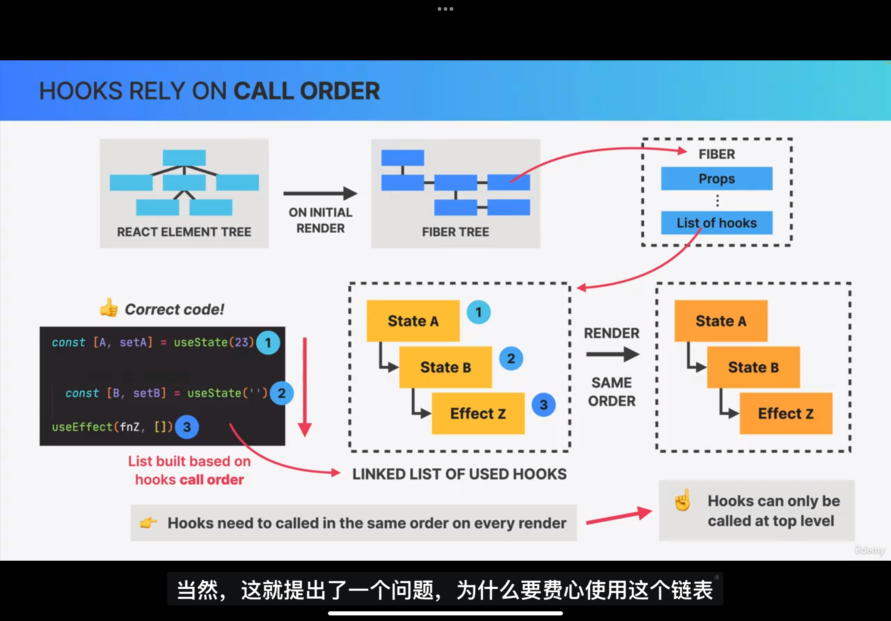
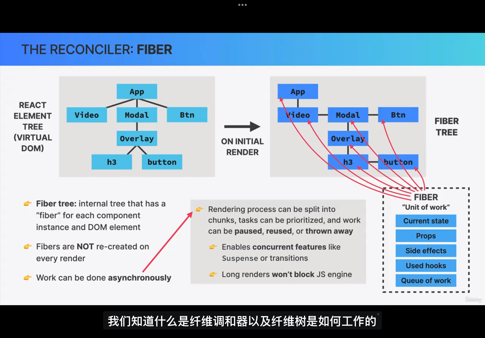
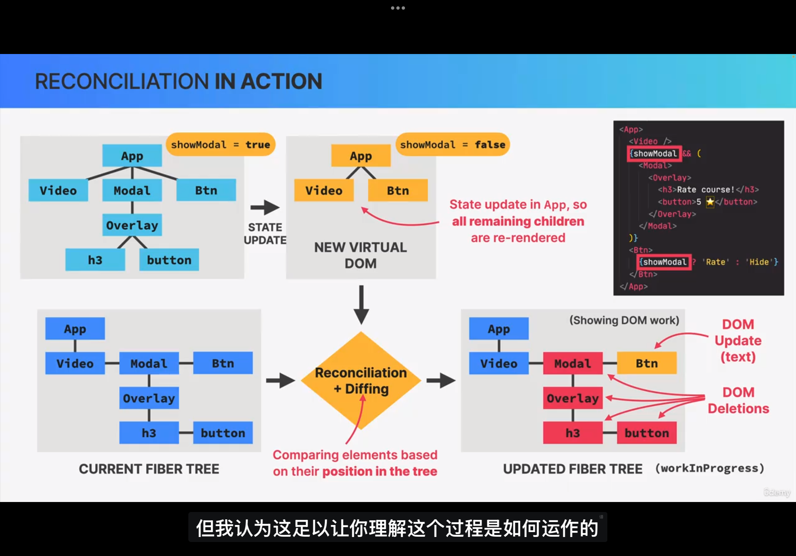
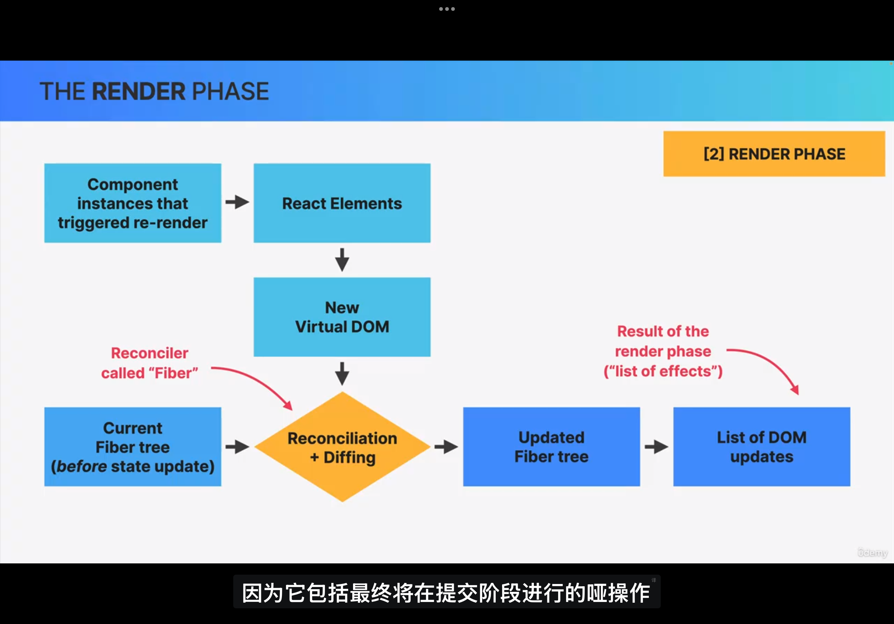
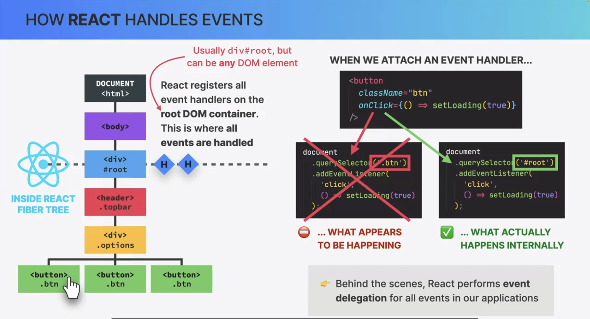
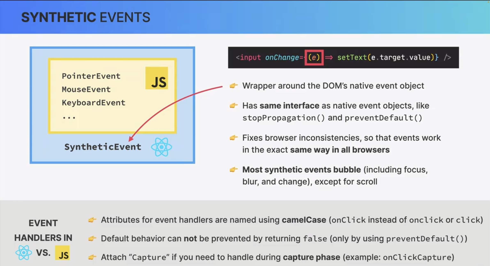

# learn-react18

## Concepts

> based on components, declarative, state-drivin

### JSX

规则

- 只能返回一个根元素
  - <>Fragment
- 标签必须闭合
- 使用驼峰式命名法给大部分属性命名
  - [`aria-*`](https://developer.mozilla.org/docs/Web/Accessibility/ARIA) 和 [`data-*`](https://developer.mozilla.org/docs/Learn/HTML/Howto/Use_data_attributes)
- 内联 `style` 属性 使用驼峰命名法编写 `<ul style={{ backgroundColor: 'black' }}>`

### 组件

组件名要大写

#### props

- Props 是只读的时间快照：每次渲染都会收到新版本的 props。
- 你不能改变 props。当你需要交互性时，你可以设置 state。

#### 条件渲染

- `&&` 不能用于判断 0
- 三元表达式 Ternary operator

#### 渲染列表

- map：
  - 需要指定 `key` 值。这些 key 会告诉 React，每个组件对应着数组里的哪一项，所以 React 可以把它们匹配起来。这在数组项进行移动（例如排序）、插入或删除等操作时非常重要。
  - `用作 key 的值应该在数据中提前就准备好，而不是在运行时才随手生成`
  - 组件不会把 `key` 当作 props 的一部分。Key 的存在只对 React 本身起到提示作用。
- filter

#### 保持组件纯粹

1. 对于相同的输入，你所编写的 React 组件必须总是返回相同的 JSX。（为那些输入未更改的组件来 [跳过渲染](https://zh-hans.react.dev/reference/react/memo)，以提高性能）

纯函数：组件作为公式

在计算机科学中（尤其是函数式编程的世界中），[纯函数](https://wikipedia.org/wiki/Pure_function) 通常具有如下特征：

- **只负责自己的任务**。它不会更改在该函数调用前就已存在的对象或变量。
- **输入相同，则输出相同**。给定相同的输入，纯函数应总是返回相同的结果。

2. 副作用：（不符合）预期的后果

React 的渲染过程必须自始至终是纯粹的。组件应该只 **返回** 它们的 JSX，而不 **改变** 在渲染前，就已存在的任何对象或变量 — 这将会使它们变得不纯粹！

3. 局部 mutation

4. 严格模式检测不纯的计算

在渲染时读取三种输入：[props](https://zh-hans.react.dev/learn/passing-props-to-a-component)，[state](https://zh-hans.react.dev/learn/state-a-components-memory) 和 [context](https://zh-hans.react.dev/learn/passing-data-deeply-with-context)。你应该始终将这些输入视为只读。

在严格模式下开发时，它将会调用每个组件函数两次（但是丢弃第二个结果）。**通过重复调用组件函数，严格模式有助于找到违反这些规则的组件**。

严格模式在生产环境下不生效，因此它不会降低应用程序的速度。如需引入严格模式，你可以用 `<React.StrictMode>` 包裹根组件。一些框架会默认这样做。

#### UI 树

- 渲染树有助于识别顶级组件和叶子组件。顶级组件会影响其下所有组件的渲染性能，而叶子组件通常会频繁重新渲染。识别它们有助于理解和调试渲染性能问题。
- 依赖树有助于调试大型捆绑包带来的渲染速度过慢的问题，以及发现哪些捆绑代码可以被优化。

#### 事件

事件传播

在 React 中所有事件都会传播，除了 `onScroll`

捕获阶段事件

```jsx
<div
  onClickCapture={() => {
    /* 这会首先执行 */
  }}
>
  <button onClick={(e) => e.stopPropagation()} />
  <button onClick={(e) => e.stopPropagation()} />
</div>
```

- [`e.stopPropagation()`](https://developer.mozilla.org/docs/Web/API/Event/stopPropagation) 阻止触发绑定在外层标签上的事件处理函数。
- [`e.preventDefault()`](https://developer.mozilla.org/docs/Web/API/Event/preventDefault) 阻止少数事件的默认浏览器行为。

#### State

##### Hooks

**Hooks ——以 `use` 开头的函数——只能在组件或[自定义 Hook](https://zh-hans.react.dev/learn/reusing-logic-with-custom-hooks) 的最顶层调用。** 不能在条件语句、循环语句或其他嵌套函数内调用 Hook。Hook 是函数，但将它们视为关于组件需求的无条件声明会很有帮助。

##### useState

1. **State 变量** 用于保存渲染间的数据。
2. **State setter 函数** 更新变量并触发 React 再次渲染组件。
3. 在 React 内部，为每个组件保存了一个数组，其中每一项都是一个 state 对。它维护当前 state 对的索引值，在渲染之前将其设置为 “0”。每次调用 useState 时，React 都会为你提供一个 state 对并增加索引值。

```js
export default function Gallery() {
  const [index, setIndex] = useState(0)
  const [showMore, setShowMore] = useState(false)
 
  // hasPrev 和 hasNext的值依赖于状态变量 index，只要 index 发生变化，它们的值也会随之变化。
  // React 的渲染机制确保每次渲染都会使用最新的 index，从而间接实现了“响应式”的效果。
  let hasPrev = index > 0
  let hasNext = index < sculptureList.length - 1
  // ...
}
```

**命名惯例**

通常可以通过相应 state 变量的第一个字母来命名更新函数的参数：

```js
setEnabled((e) => !e)
setLastName((ln) => ln.reverse())
setFriendCount((fc) => fc * 2)
```

**创建state**

```js
//1 
const [value, setValue] = useState(0)
//2 callback是纯函数以及没有入参
const [ls, setLs] = useState(()=>{
  return localStorage.getItem('ls')
})
```

**更新 state 中的对象**

将 state 视为不可变的

```js
function handleFirstNameChange(e) {
  setPerson({
    ...person,
    firstName: e.target.value
  })
}
```

**Immer**

> 由 Immer 提供的 `draft` 是一种特殊类型的对象，被称为 [Proxy](https://developer.mozilla.org/zh-CN/docs/Web/JavaScript/Reference/Global_Objects/Proxy)，它会记录你用它所进行的操作。从原理上说，Immer 会弄清楚 `draft` 对象的哪些部分被改变了，并会依照你的修改创建出一个全新的对象。

```js
import { useImmer } from 'use-immer'
function updateName(name) {
  updatePerson((draft) => {
    draft.name = name
  })
}
```

**更新 state 中的数组**

- 不要直接修改数组，而是创建它的一份 **新的** 拷贝，然后使用新的数组来更新它的状态。

#### 渲染

> 渲染必须始终是一次 **纯计算**

触发渲染

- 组件的 **初次渲染**： 当应用启动时，会触发初次渲染。
- 组件（或者其祖先之一）的 **状态发生了改变。**

React 执行渲染

- **在进行初次渲染时,** React 会调用根组件。
- **对于后续的渲染,** React 会调用内部状态更新触发了渲染的函数组件。

更改提交到 DOM

- **对于初次渲染，** React 会使用 [`appendChild()`](https://developer.mozilla.org/docs/Web/API/Node/appendChild) DOM API 将其创建的所有 DOM 节点放在屏幕上。
- **对于重渲染，** React 将应用最少的必要操作（在渲染时计算！），以使得 DOM 与最新的渲染输出相互匹配。

##### State 快照

当 React 重新渲染一个组件时：

1. React 会再次调用你的函数
2. 函数会返回新的 JSX 快照
3. React 会更新界面以匹配返回的快照

**一个 state 变量的值永远不会在一次渲染的内部发生变化，** 即使其事件处理函数的代码是异步的。

```jsx
{
  const [to, setTo] = useState('Alice')
  const [message, setMessage] = useState('你好')

  function handleSubmit(e) {
    e.preventDefault()
    setTimeout(() => {
      alert(`你向 ${to} 说了${message}`) //获取的到值还是执行时的值，而不是定时器结束时的最新值
    }, 5000)
  }
}
```

##### 批处理

等到事件处理函数中的所有 代码都运行完毕再处理 state 更新

##### 工作机制

每次渲染时，整个函数会从头到尾重新执行

- 局部变量会被重新声明和初始化

#### 类型

- Stateless/Presentation components 无状态组件： logo 组件等
- Stateful components: 复用的组件 SearchBar、List
- Structural components： 用于布局， layout、pages、screens

### 状态管理

声明式 UI 编程

Props 和 state 并不是唯一的响应式值。从它们计算出的值也是响应式的。

#### **构建 state 的原则 **

> state=component's memory

当你编写一个存有 state 的组件时，你需要选择使用多少个 state 变量以及它们都是怎样的数据格式。尽管选择次优的 state 结构下也可以编写正确的程序，但有几个原则可以指导你做出更好的决策：

1. **合并关联的 state**。如果你总是同时更新两个或更多的 state 变量，请考虑将它们合并为一个单独的 state 变量。
2. **避免互相矛盾的 state**。当 state 结构中存在多个相互矛盾或“不一致”的 state 时，你就可能为此会留下隐患。应尽量避免这种情况。
3. **避免冗余的 state**。如果你能在渲染期间从组件的 props 或其现有的 state 变量中计算出一些信息，则不应将这些信息放入该组件的 state 中。不要在 state 中镜像 props
4. **避免重复的 state**。当同一数据在多个 state 变量之间或在多个嵌套对象中重复时，这会很难保持它们同步。应尽可能减少重复。
5. **避免深度嵌套的 state**。深度分层的 state 更新起来不是很方便。如果可能的话，最好以扁平化方式构建 state。

#### Props

受控组件（由 prop 驱动）和非受控组件（由 state 驱动）

- 状态提升：当尝试保持两个不同的 state 变量之间的同步时，试试状态提升
- 子组件和父组件都需要相同的数据，那么可以让父组件获取那些数据，并将其 **向下传递** 给子组件
- 单项数据流 one-way data flow

##### children

> 默认 props
> Component composition, combining different components using the children prop

- `<Children children={"s"} ></Children>`
- `<Children>s</Children>`

- 可以解决 props 多层传递的问题 prop drilling problems
- 提高组件复用性 reusable
- 更好的组件布局 better layouts

```jsx
<main>
  <ListBox>
    <MovieList data="{movies}" />
  </ListBox>
  <WatchedBox />

  <Box element={<MovieList data={movies} />} />
  <Box
    element={
      <>
        <WatchedSummary watched={watched} />
        <WatchedMoviesList watched={watched} />
      </>
    }
  />
</main>
```

##### PropTypes

```js
import PropTypes from 'prop-types'
StarRating.propTypes = {
  maxRating: PropTypes.number.isRequired,
  defaultRating: PropTypes.number,
  color: PropTypes.string,
  size: PropTypes.number,
  messages: PropTypes.array,
  className: PropTypes.string,
  onSetRating: PropTypes.func
}
```

#### 对 State 的保留和重置

- 相同位置的相同组件会使得 state 被保留下来
- **对 React 来说重要的是组件在 UI 树中的位置,而不是在 JSX 中的位置！**
- **如果你想在重新渲染时保留 state，几次渲染中的树形结构就应该相互“匹配”**

```jsx
// Counter组件的状态会被保留
{
  isFancy ? <Counter isFancy={true} /> : <Counter isFancy={false} />
}
```

在相同位置重置 state

- 将组件渲染在不同的位置
- 使用 `key` 赋予每个组件一个明确的身份

#### When and Where


#### State vs Props


#### Reducer

> 将组件的所有状态更新逻辑整合到一个外部函数中，这个函数叫作 **reducer**

Reducer 是处理状态的另一种方式。你可以通过三个步骤将 `useState` 迁移到 `useReducer`：

1. 将设置状态的逻辑 **修改** 成 dispatch 的一个 action；
2. **编写** 一个 reducer 函数；
3. 在你的组件中 **使用** reducer。

##### useReducer

`useReducer` 钩子接受 2 个参数：

1. 一个 reducer 函数， 接收两个参数 当前状态和action
2. 一个初始的 state

它返回如下内容：

1. 一个有状态的值
2. 一个 dispatch 函数（用来 “派发” 用户操作给 reducer）

```js
// (currentState, action)
function tasksReducer(tasks, action) {
  switch (action.type) {
    case 'added': {
      return [
        ...tasks,
        {
          id: action.id,
          text: action.text,
          done: false
        }
      ]
    }
    case 'changed': {
      return tasks.map((t) => {
        if (t.id === action.task.id) {
          return action.task
        } else {
          return t
        }
      })
    }
    case 'deleted': {
      return tasks.filter((t) => t.id !== action.id)
    }
    default: {
      throw Error('未知 action: ' + action.type)
    }
  }
}

import { useReducer } from 'react'
{
  const [tasks, dispatch] = useReducer(tasksReducer, initialTasks)
  dispatch({
    type: 'changed',
    task: task
  })
}
```

##### 编写一个好的 reducer

- **reducer 必须是纯粹的。** 这一点和 [状态更新函数](https://zh-hans.react.dev/learn/queueing-a-series-of-state-updates) 是相似的，`reducer` 是在渲染时运行的！（actions 会排队直到下一次渲染)。 这就意味着 `reducer` [必须纯净](https://zh-hans.react.dev/learn/keeping-components-pure)，即当输入相同时，输出也是相同的。它们不应该包含异步请求、定时器或者任何副作用（对组件外部有影响的操作）。它们应该以不可变值的方式去更新 [对象](https://zh-hans.react.dev/learn/updating-objects-in-state) 和 [数组](https://zh-hans.react.dev/learn/updating-arrays-in-state)。
- **每个 action 都描述了一个单一的用户交互，即使它会引发数据的多个变化。** 举个例子，如果用户在一个由 `reducer` 管理的表单（包含五个表单项）中点击了 `重置按钮`，那么 dispatch 一个 `reset_form` 的 action 比 dispatch 五个单独的 `set_field` 的 action 更加合理。如果你在一个 `reducer` 中打印了所有的 `action` 日志，那么这个日志应该是很清晰的，它能让你以某种步骤复现已发生的交互或响应。

##### 使用 Immer 简化 reducer

```js
import { useImmerReducer } from 'use-immer'
```

#### Context

> **Context** 允许父组件向其下层无论多深的任何组件提供信息，而无需通过 props 显式传递。
>
> 使用 context 前优先先考虑 props、抽象组件的方案

```js
//1 创建context
import { createContext } from 'react';
export const LevelContext = createContext(1);

//2 使用conext useContext
import { useContext } from 'react';
import { LevelContext } from './LevelContext.js';
export default function Heading({ children }) {
  const level = useContext(LevelContext);
  // ...
}

// 提供context 在父组件中把 children 包在 <MyContext.Provider value={...}> 中来提供 context。
import { LevelContext } from './LevelContext.js';
export default function Section({ level, children }) {
  return (
    <section className="section">
      <LevelContext.Provider value={level}>
        {children}
      </LevelContext.Provider>
    </section>
  );
}
```

#### Reducer 与 Context 结合

为子组件提供 state 和 dispatch 函数：

1. 创建两个 context (一个用于 state,一个用于 dispatch 函数)。
2. 让组件的 context 使用 reducer。
3. 使用组件中需要读取的 context。

### 脱围机制（Escape Hatches）

> 控制和同步 React 之外的系统

#### ref

> 当一条信息仅被事件处理器需要，并且更改它不需要重新渲染时，使用 ref 可能会更高效。

- 更改时不会触发重新渲染
- 可变。当你改变 ref 的 current 值时，它会立即改变
- 不要在渲染过程中读取或写入 `ref.current`

```js
import { useRef } from 'react'

export default function Counter() {
  let ref = useRef(0)

  function handleClick() {
    ref.current = ref.current + 1 //更改时不会触发重新渲染
    alert('你点击了 ' + ref.current + ' 次！')
  }

  return <button onClick={handleClick}>点击我！{ref.current}</button>
}
```

内部实现基于`useState`

```js
// React 内部
function useRef(initialValue) {
  const [ref, unused] = useState({ current: initialValue })
  return ref
}
```

使用场景

当你的组件需要“跳出” React 并与外部 API 通信时，你会用到 ref —— 通常是不会影响组件外观的浏览器 API。以下是这些罕见情况中的几个：

- 存储 timeout ID（在函数组件中，局部变量每次渲染都会重新初始化）
- 存储和操作 DOM 元素 `<div ref={myRef}>`
- 存储不需要被用来计算 JSX 的其他对象。

#### ref 操作 dom

```js
import { useRef } from 'react';
const myRef = useRef(null);
<div ref={myRef}>
```

ref 列表

```jsx
export default function () {
  const itemsRef = useRef(null)

  function getMap() {
    if (!itemsRef.current) {
      // 首次运行时初始化 Map。
      itemsRef.current = new Map()
    }
    return itemsRef.current
  }

  return (
    <li
      key={cat.id}
      ref={(node) => {
        const map = getMap()
        // 添加到 Map 中
        map.set(cat, node)
        return () => {
          // 从 Map 中移除
          map.delete(cat)
        }
      }}
    />
  )
}
```

##### 组件不暴露 DOM

useImperativeHandle

> 限制暴露的功能
>
> react19 前组件需要用 forwardRef 定义

```js
function MyInput({ ref }) {
  const realInputRef = useRef(null)
  useImperativeHandle(ref, () => ({
    // 只暴露 focus，没有别的
    focus() {
      realInputRef.current.focus()
    }
  }))
  return <input ref={realInputRef} />
}
```

##### flushSync

> 强制 React 同步更新（“刷新”）DOM

```js
flushSync(() => {
  setTodos([...todos, newTodo])
})
listRef.current.lastChild.scrollIntoView()
```

#### Effect

> 允许在渲染结束后执行一些代码，以便将组件与 React 外部的某个系统相同步。
>
> **允许你指定由渲染自身，而不是特定事件引起的副作用**

1. 声明 effect
2. 指定依赖:
   - 不指定的话默认每次渲染后都会执行
   - []: 只有首次渲染后会执行
   - 依赖数组可以包含多个依赖项。只有当你指定的 **所有** 依赖项的值都与上一次渲染时完全相同，React 才会跳过重新运行该 Effect。React 使用 [`Object.is`](https://developer.mozilla.org/zh-CN/docs/Web/JavaScript/Reference/Global_Objects/Object/is) 来比较依赖项的值
3. 添加清理（cleanup）函数： 每次 Effect 重新运行之前调用清理函数，并在组件卸载（被移除）时最后一次调用清理函数

```js
import { useEffect, useState } from 'react'
function MyComponent() {
  const [isPlaying] = useState(false)
  useEffect(() => {
    // 每次渲染后都会执行此处的代码
    if (isPlaying) {
      // NOTE:  ref 具有 稳定 的标识：React 确保你在 每轮渲染中调用同一个 useRef 时，总能获得相同的对象。ref 不会改变，所以它不会导致重新运行 Effect。如果 ref 是从父组件传递过来的，则必须在依赖数组中指定它
      ref.current.play()
    } else {
    }
  }, [isPlaying])

  useEffect(() => {
    const connection = createConnection()
    connection.connect()
    // 返回清理函数
    return () => {
      connection.disconnect()
    }
  }, [])
  return <div />
}
```

##### 使用注意事项

> 如果这个逻辑是由某个特定的交互引起的，请将它保留在相应的事件处理函数中。如果是由用户在屏幕上 **看到** 组件时引起的，请将它保留在 Effect 中。

- 尽量不根据 props 或其他 state 来调整 state
- 避免在 Effect 中处理属于事件特定的逻辑
- 避免链接多个 Effect 仅仅为了相互触发调整 state
- 避免：把只需要执行一次的逻辑放在 Effect 中： 应用初始化的代码
- 在 useEffect 中请求数据时需要添加清理函数，避免“竞态条件”
- **组件内部的所有值（包括 props、state 和组件体内的变量）都是响应式的。任何响应式值都可以在重新渲染时发生变化，所以需要将响应式值包括在 Effect 的依赖项中**。
- 可变值不能作为依赖项
- 抑制代码检查 `eslint-disable-next-line react-hooks/exhaustive-deps`

##### Effect 的声明周期

- 每个 Effect 描述了一个独立的同步过程，可以 **开始** 和 **停止**。独立地考虑每个 Effect（如何开始和停止同步），而不是从组件的角度思考

##### 将事件从 Effect 中分开

> 一个 Effect 只在响应某些值时重新运行，但是在其他值变化时不重新运行

- 事件处理函数只在响应特定的交互操作时运行
- 每当需要同步，Effect 就会运行

###### useEffectEvent

> 实验性 API
>
> 将非响应式逻辑从 Effect 移到 Effect Event 中

```js
const onVisit = useEffectEvent((visitedUrl) => {
  // 内部的代码是非响应式的
  logVisit(visitedUrl, numberOfItems)
})

useEffect(() => {
  setTimeout(() => {
    onVisit(url)
  }, 5000) // 延迟记录访问
}, [url])
```

命名

- `onMessage`，`onTick`，`onVisit` 或者 `onConnected` 是优秀的 Effect Event 名称。
- `onMount`，`onUpdate`，`onUnmount` 或者 `onAfterRender` 太通用了，以至于很容易不小心就把一些”应该”是响应式的代码放入其中。

#### hooks

##### 规则

- 只能在顶层调用，不能在条件语句中使用。react内部对hook是以调用顺序来标识hook的



- 

##### 自定义 Hook

- 必须永远以 `use` 开头
- 只有 Hook 和组件可以调用其他 Hook
- 创建的函数没有调用任何 Hook 方法，在命名时应避免使用 `use` 前缀，把它当成一个常规函数去命名

##### useCallback

##### useMemo

##### useTansition

##### useDeferredValue

不常用

- useImperativeHandle
- useDebugValue
- useLayoutEffect
- useId

- useSyncExternalStore

> 读取和订阅外部 store 或可变值
>
> 开发库时使用

```js
function subscribe(callback) {
  window.addEventListener('online', callback)
  window.addEventListener('offline', callback)
  return () => {
    window.removeEventListener('online', callback)
    window.removeEventListener('offline', callback)
  }
}

function useOnlineStatus() {
  // ✅ 非常好：用内置的 Hook 订阅外部 store
  return useSyncExternalStore(
    subscribe, // 只要传递的是同一个函数，React 不会重新订阅
    () => navigator.onLine, // 如何在客户端获取值
    () => true // 如何在服务端获取值
  )
}

function ChatIndicator() {
  const isOnline = useOnlineStatus()
  // ...
}
```

### 组件

#### Fragment

- `<Fragment></Fragment> `
- `<></>`

## How react works behind the scenes

### 组件

- component
- component instance
  - `<Tab />`
  - `Tab()`如果以函数形式直接调用 react 不会把它看成是组件实例
- React Element： jsx 转换为`React.crateElement()`
- Dom Element: 最终转换为 dom

#### component lifcycle

- mount/inital render
- re-render： state changes、props change、parent re-renders、context changes
- unmount

### Rendering

- 触发 render trigger renders
  - 应用初始化
  - state is updated（re-render）
  - 不会立即执行，微任务
- render 阶段: 异步

  - 重新执行有更新的组件，生成新的虚拟 dom。子节点也会重新生成虚拟 dom
  - 对比（reconciliation）和 diffing 新旧虚拟 dom tree， 得到 `Updated Fiber Tree`

    - diffing

  

  

  

- commit 阶段： 同步

  - 更新真实 dom（`react-dom`）

- 浏览器 paint

### Diffing

#### key

- 给元素唯一标识 允许 react 区分相同组件的多个实例
- 在 render 时，如果 key 保持不变的话，对应元素会保留在 dom 中，即使它的位置发生变化；key 改变的话，对应元素会被销毁从而创建一个新的元素（用于重置 state）

### State Update Batching

### Event

采用事件代理的方式，元素事件注册在根元素




